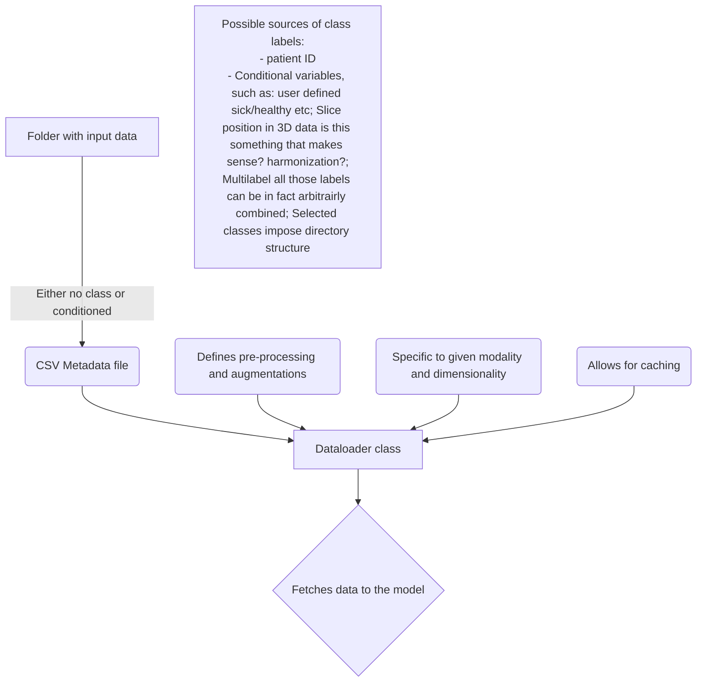

```mermaid
flowchart TD
    A[Folder with input data] -->|Either no class or conditioned| B(CSV Metadata file)
    B --> C[Dataloader class]
    D(Defines pre-processing and augmentations) --> C
    E(Specific to given modality and dimensionality) --> C
    F(Allows for caching) --> C 
    C --> G{Fetches data to the model}
    H[Possible sources of class labels:
- patient ID
- Conditional variables, such as: user defined sick/healthy etc; Slice position in 3D data is this something that makes sense? harmonization?;
Multilabel all those labels can be in fact arbitrairly combined; Selected classes impose directory structure]
```
