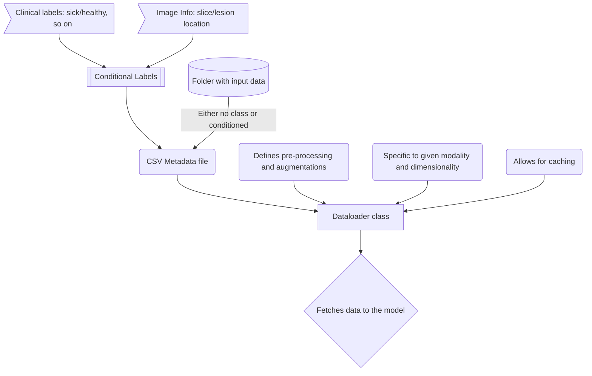

```mermaid
flowchart TD
    L0>Clinical labels: sick/healthy, so on] -->Labels
    L1>Image Info: slice/lesion location] -->Labels
    Labels[[Conditional Labels]] -->B
    A[(Folder with input data)] -->|Either no class or conditioned| B(CSV Metadata file)
    B --> C[Dataloader class]
    D(Defines pre-processing and augmentations) --> C
    E(Specific to given modality and dimensionality) --> C
    F(Allows for caching) --> C 
    C --> G{Fetches data to the model}
```
