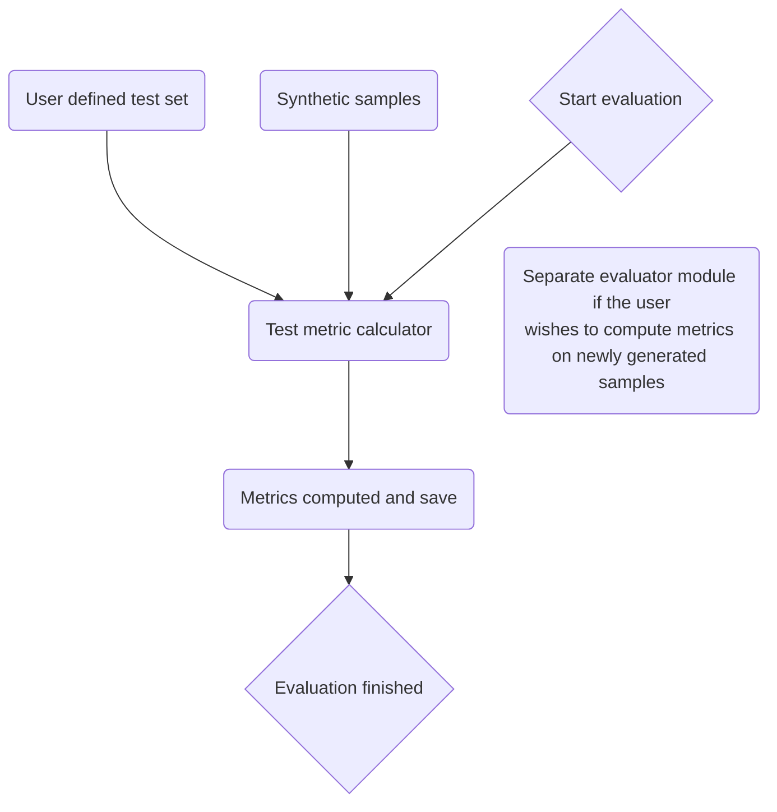

```mermaid
flowchart TD
A{Start evaluation} --> B(Test metric calculator)
A ~~~ AComm(Separate evaluator module if the user
wishes to compute metrics on newly generated samples
)
C(Synthetic samples) --> B
D(User defined test set) --> B
B --> E(Metrics computed and save)
E --> F{Evaluation  finished}
```
