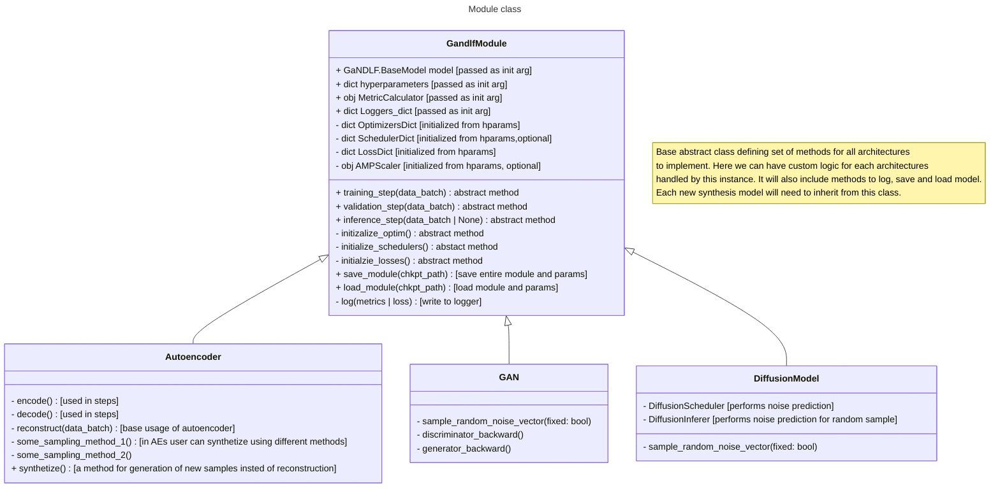

```mermaid
---
title: Module class
---
classDiagram
    note "Base abstract class defining set of methods for all architectures
    to implement. Here we can have custom logic for each architectures
    handled by this instance. It will also include methods to log, save and load model.
    Each new synthesis model will need to inherit from this class.
    "
    GandlfModule : + GaNDLF.BaseModel model [passed as init arg]
    GandlfModule : + dict hyperparameters [passed as init arg]
    GandlfModule : + obj MetricCalculator [passed as init arg]
    GandlfModule : + dict Loggers_dict [passed as init arg]  
    GandlfModule : - dict OptimizersDict [initialized from hparams]
    GandlfModule : - dict SchedulerDict [initialized from hparams,optional]
    GandlfModule : - dict LossDict [initialized from hparams]
    GandlfModule : - obj AMPScaler [initialized from hparams, optional]
    GandlfModule : + training_step(data_batch) abstract method
    GandlfModule : + validation_step(data_batch) abstract method
    GandlfModule : + inference_step(data_batch | None) abstract method
    GandlfModule : - initizalize_optim() abstract method
    GandlfModule : - initialize_schedulers() abstact method
    GandlfModule : - initialzie_losses() abstract method
    GandlfModule : + save_module(chkpt_path) [save entire module and params]
    GandlfModule : + load_module(chkpt_path) [load module and params]
    GandlfModule : - log(metrics | loss) [write to logger]
    class Autoencoder{
        - encode() [used in steps]
        - decode() [used in steps]
        - reconstruct(data_batch) [base usage of autoencoder]
        - some_sampling_method_1() [in AEs user can synthetize using different methods]
        - some_sampling_method_2()
        + synthetize() [a method for generation of new samples insted of reconstruction]

    }
    class GAN {
        - sample_random_noise_vector(fixed: bool)
        - discriminator_backward()
        - generator_backward()
    }

    class DiffusionModel {
        - sample_random_noise_vector(fixed: bool)
        - DiffusionScheduler [performs noise prediction]
        - DiffusionInferer [performs noise prediction for random sample]
    }

    
    GandlfModule <|-- Autoencoder
    GandlfModule <|-- GAN
    GandlfModule <|-- DiffusionModel
```