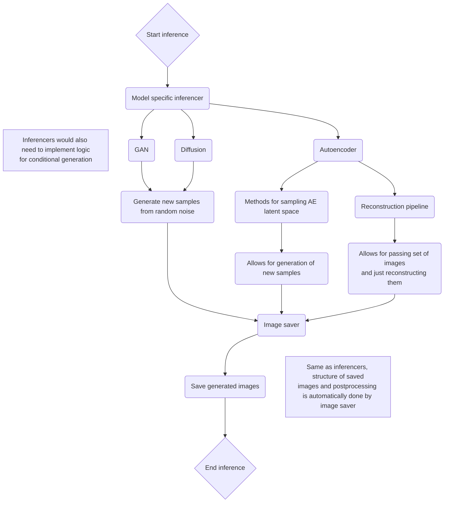

```mermaid
flowchart TD
A{Start inference} --> B(Model specific inferencer)
B ~~~ BComm[Inferencers would also need to implement logic
for conditional generation]
B --> C(Autoencoder)
B --> D(GAN)
B --> E(Diffusion)
C --> C1(Reconstruction pipeline)
%% ae
C1 --> C11(Allows for passing set of images
and just reconstructing them)
C --> C2(Methods for sampling AE latent space)
C2 --> C21(Allows for generation of new samples)
%% GAN
D --> D1(Generate new samples from random noise)
E --> D1

D1 --> F(Image saver)
C21 --> F
C11 --> F
F --> G(Save generated images)
F ~~~ FComm[Same as inferencers, structure of saved
images and postprocessing is automatically done by image saver]
G --> H{End inference}
```
