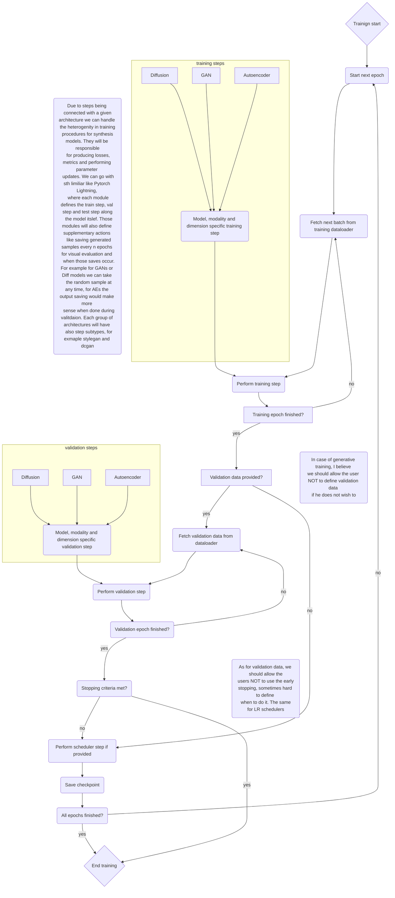

```mermaid
flowchart TD
A{Trainign start} --> B(Start next epoch)
B--> C(Fetch next batch from training dataloader)
C --> D(Perform training step)
%% model specific trainign steps
D1(Model, modality and dimension specific training step) -->D
D11 ~~~ DComment(Due to steps being connected with a given
architecture we can handle the heterogenity in training
 procedures for synthesis models. They will be responsible
  for producing losses, metrics and performing parameter 
  updates. We can go with sth limiliar like Pytorch Lightning, 
  where each module defines the train step, val step and test step along
   the model itslef. Those modules will also define supplementary actions 
   like saving generated samples every n epochs for visual evaluation and 
   when those saves occur. For example for GANs or Diff models we can take 
   the random sample at any time, for AEs the output saving would make more 
   sense when done during valitdaion. Each group of architectures will have 
   also step subtypes, for exmaple stylegan and dcgan)
subgraph training steps
D11[Diffusion] --> D1
D12[GAN] --> D1
D13[Autoencoder] --> D1
end
D --> E[Training epoch finished?]
E --> |yes| F[Validation data provided?]
E ~~~ Ecomm(In case of generative training, I believe 
we should allow the user NOT to define validation data 
if he does not wish to)
E --> |no| C
%% valdiation
F --> |yes| F1(Fetch validation data from dataloader)
F1 --> G(Perform validation step)
%% model specific validation steps
G1(Model, modality and dimension specific validation step) --> G
subgraph validation steps
G11[Diffusion] --> G1
G12[GAN] --> G1
G13[Autoencoder] --> G1
end
%% 
G --> F2(Validation epoch finished?)
F2 --> |no| F1
F2 --> |yes| F3(Stopping criteria met?)
F2 ~~~ F2Comm(As for validation data, we should allow the
 users NOT to use the early stopping, sometimes hard to define 
 when to do it. The same for LR schedulers )
F3 --> |no| H
F3 --> |yes| K


F --> |no| H(Perform scheduler step if provided)
H --> I(Save checkpoint)
I --> J(All epochs finished?)
J --> |no| B
J --> |yes| K{End training}
```
